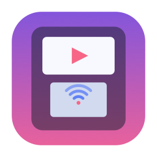
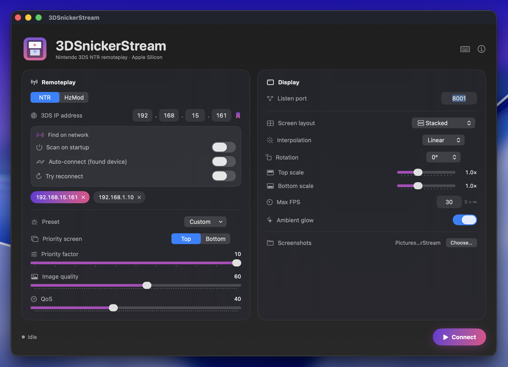
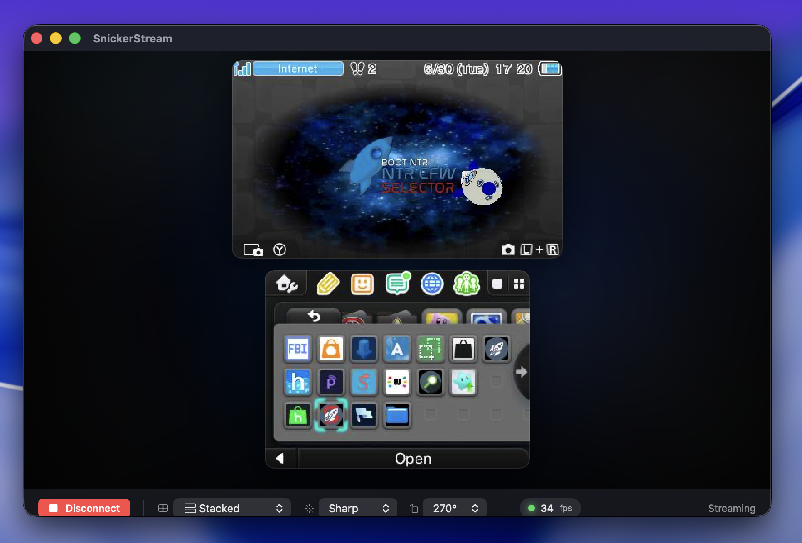
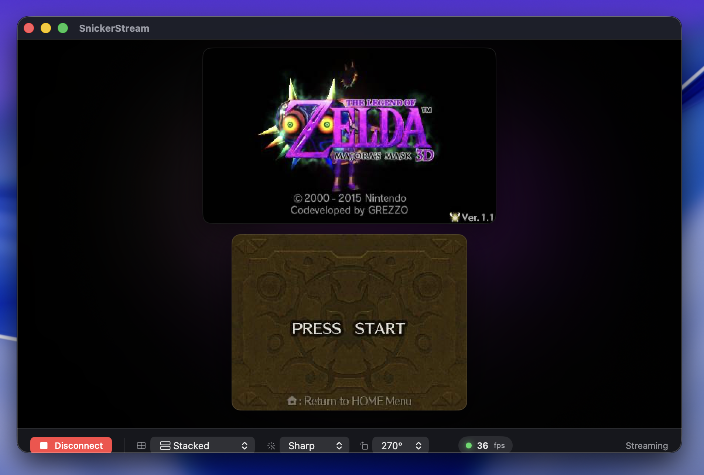
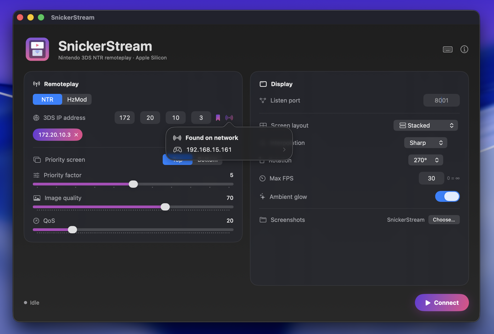
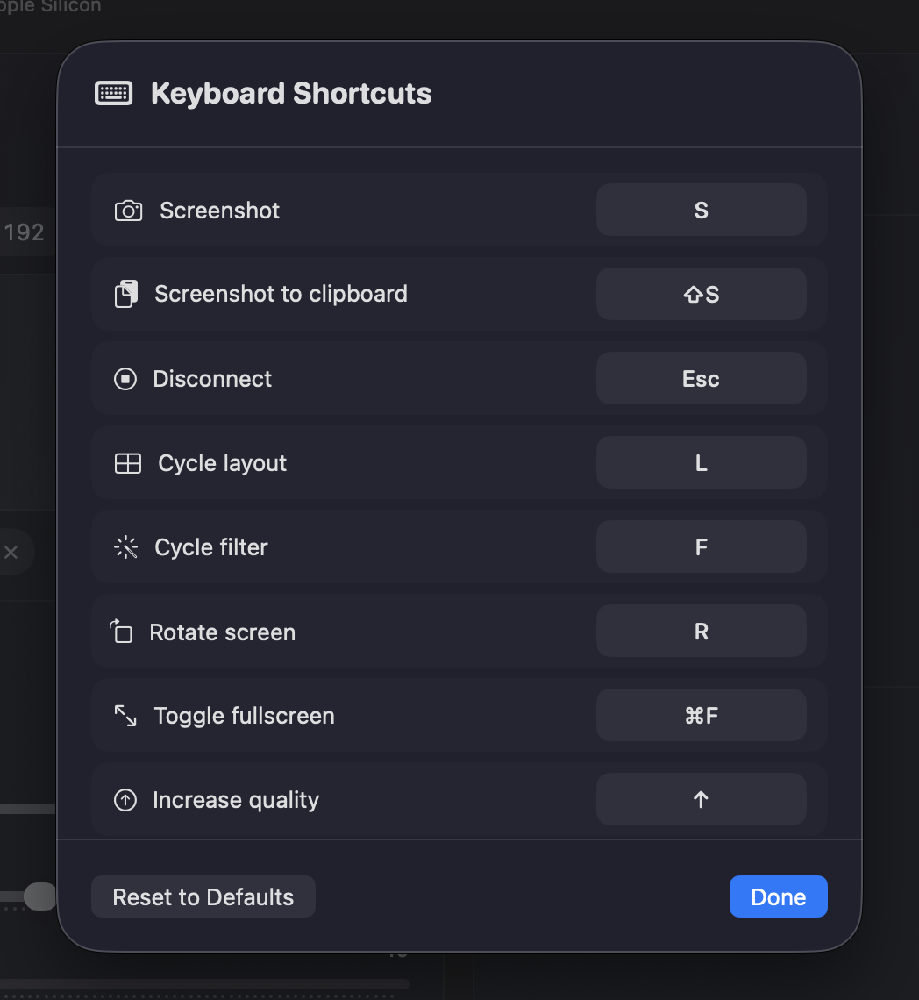

<div align="center">



# 3DSnickerStream

**Stream your Nintendo 3DS to your Mac — natively, on Apple Silicon.**


</div>



---

## Why this exists

[Snickerstream](https://github.com/RattletraPM/Snickerstream) is a great tool for streaming a
3DS screen to a computer — but it only runs on Windows. I wanted to use it on my Mac, and
there wasn't a native option.

So I made one. To be upfront: I didn't hand-write this code myself — I built it together with
**[Claude](https://claude.com/claude-code)** (Anthropic's AI), describing what I wanted and
testing every step against my own 3DS until it actually worked. It's a fresh **Swift / SwiftUI**
app rather than a port of the original Windows code — the NTR and HzMod streaming protocols were
figured out by reading the original project's source.

The result is a real, native Apple Silicon app that connects to my 3DS over Wi-Fi and shows
both screens in real time.

## It works

<table>
<tr>
<td width="50%"></td>
<td width="50%"></td>
</tr>
<tr>
<td align="center"><sub>HOME menu — live</sub></td>
<td align="center"><sub><i>Majora's Mask 3D</i> — live, ~36 fps</sub></td>
</tr>
</table>

These are real captures from a 3DS streaming to a Mac. The soft glow behind the screens picks
up the colors of whatever's on screen.

## What it does

- 🎮 **NTR remoteplay** — the main way to stream; tested and working on real hardware
- 🧪 **HzMod** — the original's other protocol (beta — see below)
- 📡 **Find my 3DS** — scan the network and pick the console instead of typing its IP
- 🖥️ **Both screens**, arranged how you like: stacked, side by side, or one at a time
- 🔖 **Saved consoles** — bookmark an IP and reconnect with one click
- ⌨️ **Keyboard shortcuts** you can remap (screenshot, layout, rotate, quality, fullscreen…)
- 📸 **Screenshots** to a folder of your choice
- 🎚️ **Playback FPS cap** — limit how much is drawn without changing what the 3DS sends
- 🔁 **Doesn't lie about connecting** — if the 3DS doesn't answer, it retries a few times and
  takes you back, instead of sitting on a black screen
- ✨ Sharp/linear/smooth scaling, rotation, and an optional ambient glow

<p align="center">
  
  <br><sub>Hit the radar button and pick your console — no need to hunt for its IP.</sub>
</p>

### Keyboard shortcuts



| Action | Default | Action | Default |
|--------|:-------:|--------|:-------:|
| Screenshot | `S` | Toggle fullscreen | `⌘F` |
| Disconnect | `Esc` | Increase quality | `↑` |
| Cycle layout | `L` | Decrease quality | `↓` |
| Cycle filter | `F` | Swap priority screen | `P` |
| Rotate screen | `R` | | |

All remappable from the **⌨️ Keyboard Shortcuts** menu.

## Getting started

**You'll need:** an Apple Silicon Mac on **macOS 13+**, and a 3DS on the **same network**
running **NTR CFW** (or HzMod) with remoteplay.

**Install:** grab the latest `3DSnickerStream-mac.zip` from the [Releases](../../releases) page,
unzip it, and drag **3DSnickerStream.app** to Applications. The app isn't notarized, so the first
time you'll need to **right-click → Open** (or allow it under *System Settings → Privacy &
Security*). On the first connection, allow **Local Network** access so it can reach the 3DS.

**Then:**
1. On the 3DS, start NTR and enable remoteplay.
2. In the app, type the 3DS's IP — or hit the radar button to find it automatically.
3. Click **Connect**. The screens show up once the stream starts.

## Build it yourself

```bash
git clone -b macos-apple-silicon https://github.com/samaBR85/3DSnickerStream.git
cd 3DSnickerStream
./build-app.sh            # produces 3DSnickerStream.app
open 3DSnickerStream.app
```

## A note on the two protocols

- **NTR** — solid. This is what I use and test with.
- **HzMod** — **beta.** It connects and streams (top screen only, like the original), but I
  reconstructed its frame format from the original source and couldn't test every case, so it
  may need tweaks. If something looks off, please open an issue.

<details>
<summary>Technical details (for the curious)</summary>

Both protocols were reverse-engineered from the original project's `include/ntr.au3` and
`include/HzMod.au3`.

**NTR** — the app connects to `3DS:8000`, sends an 84-byte command (magic `0x12345678`,
command `901`) carrying the priority/quality/QoS settings, then the 3DS streams JPEG frames as
UDP packets to the Mac on port `8001`. Each packet has a tiny header (frame id, screen +
last-packet flag, packet number) and a slice of a JPEG; the app reassembles them until the
last-packet flag and decodes the result.

**HzMod** — the app connects to `3DS:6464` over TCP, sends a CPU-limit, quality, and start
packet, then reads JPEG frames back. To stay robust against the ambiguous header layout, the
app just scans the byte stream for complete JPEGs (`FF D8` … `FF D9`).

Decoding and rotation use ImageIO / Core Graphics, and the two screens are drawn by a
layer-backed view so the stream stays smooth.

</details>

## Credits & license

Built on the work of the original **[Snickerstream](https://github.com/RattletraPM/Snickerstream)**
by RattletraPM and contributors — this project follows the same protocols and is licensed under
**GPLv3** ([LICENSE](LICENSE)). The Mac app was written with the help of
[Claude](https://claude.com/claude-code).
