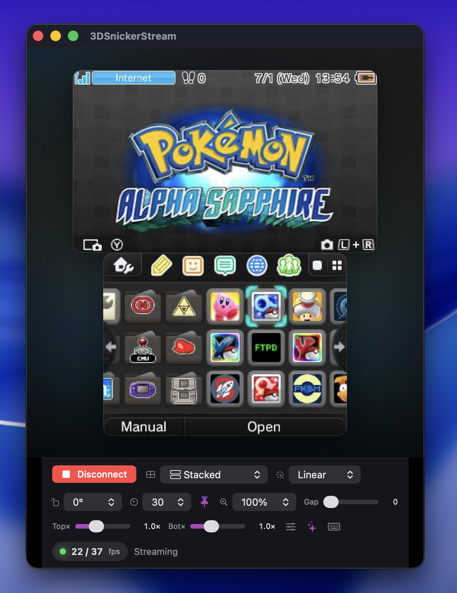
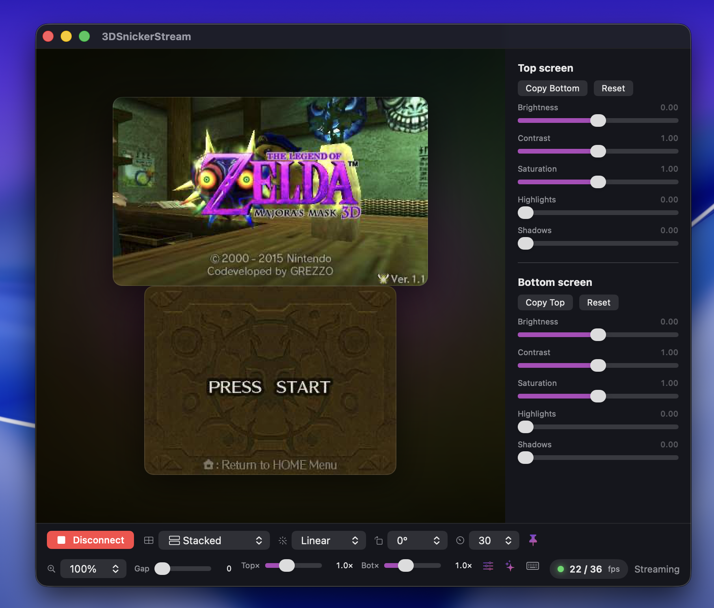

<div align="center">


# 3DSnickerStream

**Stream your Nintendo 3DS to your computer — natively, on macOS and Windows.**


</div>


---

## Why this exists

[Snickerstream](https://github.com/RattletraPM/Snickerstream) is a great tool for streaming a
3DS screen to a computer — but the original only runs on Windows and isn't native. I wanted a
clean, native app, so I made one — first for my **Mac**, then a matching **Windows** build.

To be upfront: I didn't hand-write this code myself — I built it together with
**[Claude](https://claude.com/claude-code)** (Anthropic's AI), describing what I wanted and
testing every step against my own 3DS until it actually worked. Each platform is a fresh native
app (SwiftUI on macOS, WPF/.NET on Windows) rather than a port of the original code — the NTR and
HzMod streaming protocols were figured out by reading the original project's source.

The result is a real, native app on **both platforms** that connects to a 3DS over Wi-Fi and
shows both screens in real time.

## It works

<table>
<tr>
<td width="50%"></td>
<td width="50%"></td>
</tr>
<tr>
<td align="center"><sub>Resizable window · responsive controls</sub></td>
<td align="center"><sub>Per-screen color adjust</sub></td>
</tr>
</table>

Real captures from a 3DS streaming to a Mac. The controls reflow as the window shrinks, and the
soft glow behind the screens picks up the colors of whatever's on screen.

## What it does

- 🎮 **NTR remoteplay** — the main way to stream; tested and working on real hardware
- 🧪 **HzMod** — the original's other protocol (beta — see below)
- 📡 **Find my 3DS** — scan the network and pick the console instead of typing its IP; optional
  scan-on-startup, auto-connect, and auto-reconnect
- 🖥️ **Both screens**, arranged how you like: stacked, side by side, or one at a time — with
  adjustable **gap** and **per-screen scale**
- 🎨 **Per-screen color adjust** — brightness / contrast / saturation / highlights / shadows
- 🔍 **Zoom** (Fit or 100–300% native) and a **clean mode** (`H`) that hides all UI
- 🔖 **Saved consoles** — bookmark an IP and reconnect with one click
- 🎛️ **Quality/framerate presets** (plus your own custom ones)
- ⌨️ **Remappable keyboard shortcuts**; **screenshots** to a folder or the clipboard
- 🎚️ **Playback FPS cap** — limit how much is drawn without changing what the 3DS sends
- 🔁 **Doesn't lie about connecting** — retries if the 3DS doesn't answer instead of showing a black screen
- ✨ Sharp/linear/smooth scaling, rotation, and an optional ambient glow

### Keyboard shortcuts


| Action | Default | Action | Default |
|--------|:-------:|--------|:-------:|
| Screenshot | `S` | Toggle fullscreen | `⌘F` |
| Screenshot to clipboard | `⇧S` | Increase quality | `↑` |
| Disconnect | `Esc` | Decrease quality | `↓` |
| Cycle layout | `L` | Swap priority screen | `P` |
| Cycle filter | `F` | Clean mode (hide UI) | `H` |
| Rotate screen | `R` | | |

All remappable from the **⌨️ Keyboard Shortcuts** menu.

## Getting started

**You'll need** a 3DS on the **same network** running **NTR CFW** (or HzMod) with remoteplay,
plus one of:

- **macOS 13+** on Apple Silicon, or
- **Windows 10/11**.

**Download:** each release on the [Releases](../../releases) page carries both builds —
`3DSnickerStream-mac.zip` and `3DSnickerStream-win.zip`.

- **macOS:** unzip and drag **3DSnickerStream.app** to Applications. It isn't notarized, so the
  first launch needs **right-click → Open**. Allow **Local Network** access on first connect.
- **Windows:** unzip and run **3DSnickerStream.exe**. SmartScreen may warn on an unsigned app
  (**More info → Run anyway**); allow it through the **firewall** on first connect.

**Then:**
1. On the 3DS, start NTR and enable remoteplay.
2. In the app, type the 3DS's IP — or hit the radar button to find it automatically.
3. Click **Connect**. The screens show up once the stream starts.

## Build it yourself

**macOS** (this branch):

```bash
git clone -b macos-apple-silicon https://github.com/samaBR85/3DSnickerStream.git
cd 3DSnickerStream
./build-app.sh            # produces 3DSnickerStream.app
open 3DSnickerStream.app
```

**Windows** lives on the [`windows`](../../tree/windows) branch (WPF / .NET) —
`dotnet publish -c Release -r win-x64 --self-contained`.

## A note on the two protocols

- **NTR** — solid. This is what I use and test with.
- **HzMod** — **beta.** It connects and streams (top screen only, like the original), but I
  reconstructed its frame format from the original source and couldn't test every case, so it
  may need tweaks. If something looks off, please open an issue.

<details>
<summary>Technical details (for the curious)</summary>

Both protocols were reverse-engineered from the original project's `include/ntr.au3` and
`include/HzMod.au3`.

**NTR** — the app connects to `3DS:8000`, sends an 84-byte command (magic `0x12345678`,
command `901`) carrying the priority/quality/QoS settings, then the 3DS streams JPEG frames as
UDP packets to the Mac on port `8001`. Each packet has a tiny header (frame id, screen +
last-packet flag, packet number) and a slice of a JPEG; the app reassembles them until the
last-packet flag and decodes the result.

**HzMod** — the app connects to `3DS:6464` over TCP, sends a CPU-limit, quality, and start
packet, then reads JPEG frames back. To stay robust against the ambiguous header layout, the
app just scans the byte stream for complete JPEGs (`FF D8` … `FF D9`).

Decoding and rotation use ImageIO / Core Graphics, and the two screens are drawn by a
layer-backed view so the stream stays smooth.

</details>

## Credits & license

Built on the work of the original **[Snickerstream](https://github.com/RattletraPM/Snickerstream)**
by RattletraPM and contributors — this project follows the same protocols and is licensed under
**GPLv3** ([LICENSE](LICENSE)).

- Original by **[RattletraPM](https://github.com/RattletraPM)**
- Revision by **[samaBR](https://github.com/samaBR85)**

Written with the help of [Claude](https://claude.com/claude-code).
