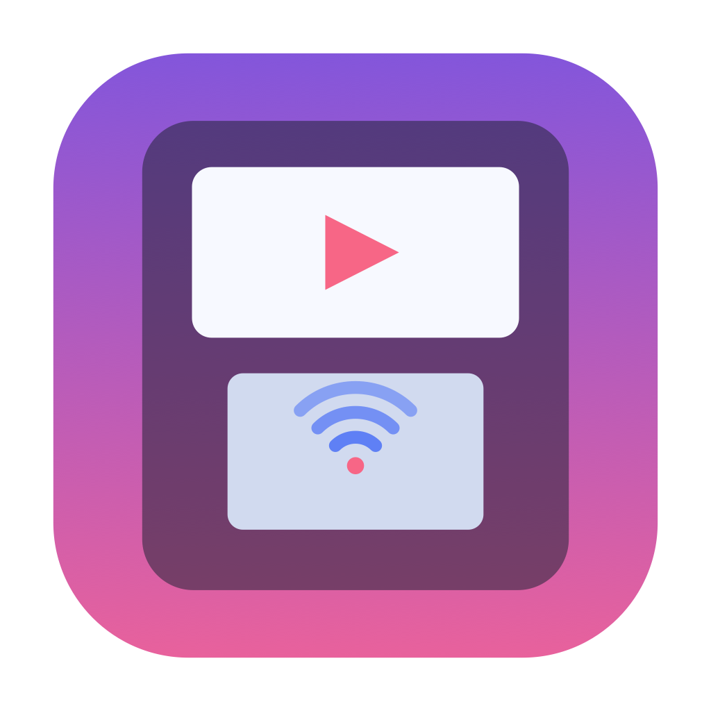
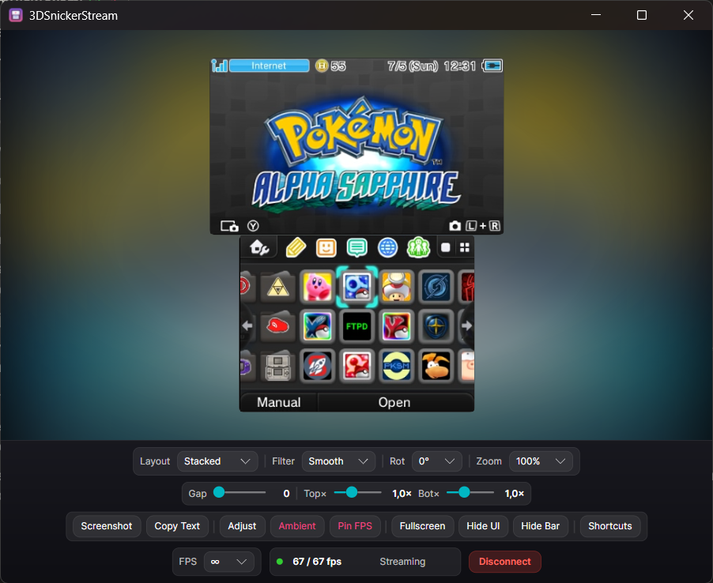
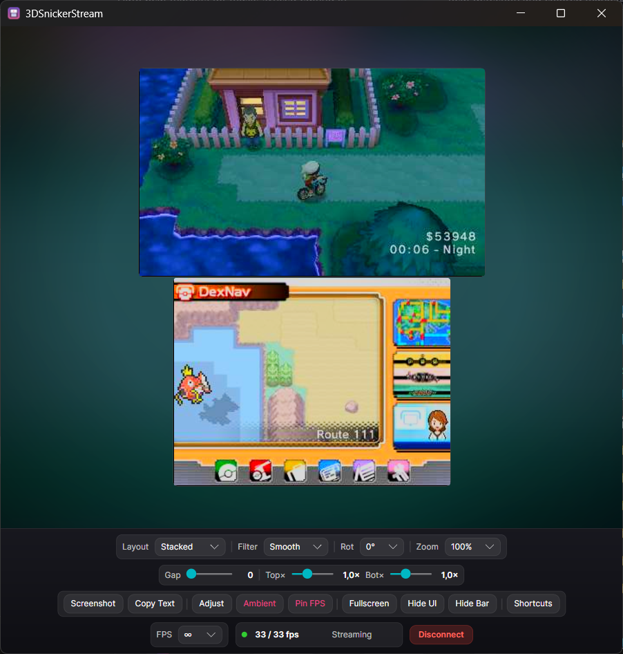
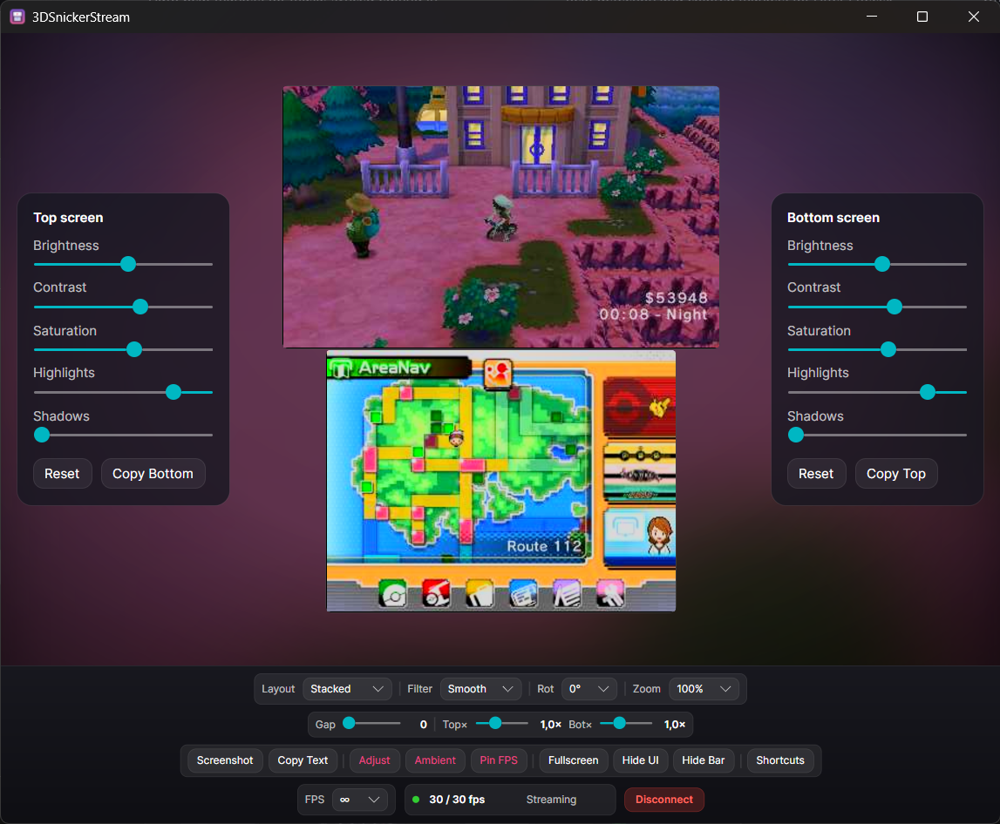
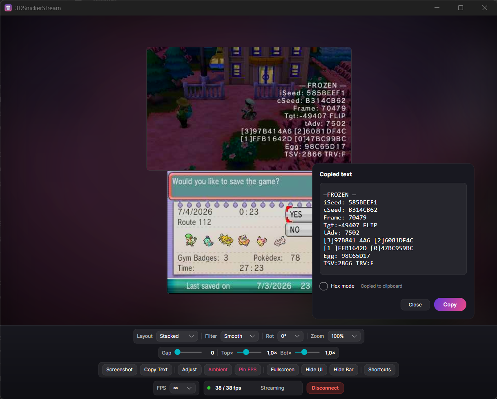
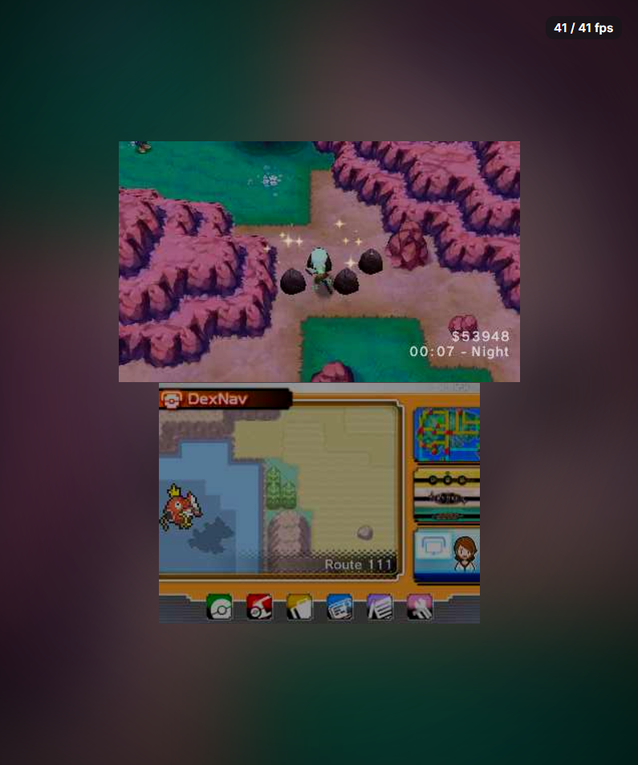
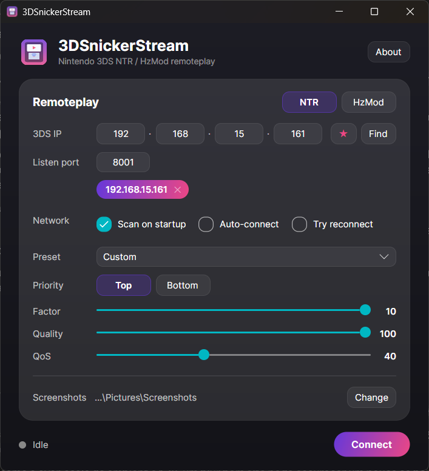
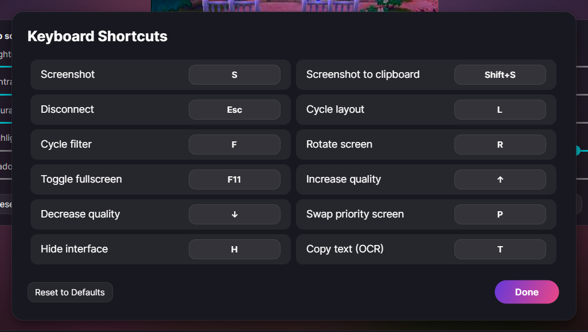
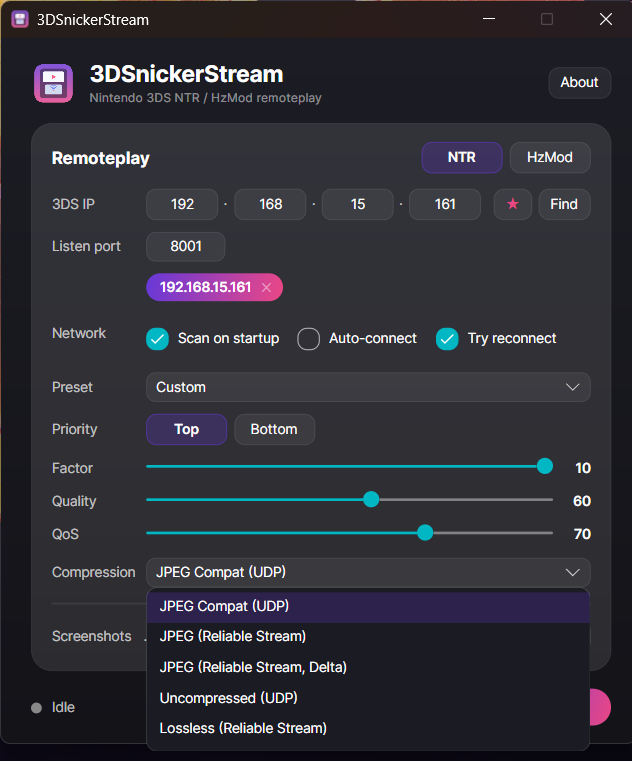

<div align="center">



# 3DSnickerStream

**Stream your Nintendo 3DS to your PC — Windows, macOS and Linux, one app.**

A modern, cross-platform remoteplay client for the 3DS (NTR CFW and HzMod),
rebuilt from the ground up on [Avalonia UI](https://avaloniaui.net/). Successor to
RattletraPM's original [Snickerstream](https://github.com/RattletraPM/Snickerstream).



</div>

---

## Features

- **NTR & HzMod** remoteplay — dual-screen NTR, or top-screen HzMod (beta).
- **NTR-HR compression formats** — beyond the classic JPEG-over-UDP, pick **Uncompressed (UDP)**, the
  reliable, retransmitted **JPEG (Reliable Stream)** / **JPEG (Reliable Stream, Delta)** modes for
  smooth, low-bandwidth streaming (Delta only sends what changed), or **Lossless (Reliable Stream)** for
  artifact-free colour.
- **Live stream view** with Stacked / Side-by-side / Top-only / Bottom-only layouts,
  free rotation, per-screen zoom, gap and scale.
- **Per-screen color adjustment** — brightness, contrast and saturation, top and bottom independently.
- **Ambient glow** — an ambilight-style backdrop fed from the live top screen.
- **Clean mode & fullscreen** — hide all chrome for a borderless, aspect-fitted picture.
- **Copy text from the stream (OCR)** — marquee-select any region and copy the recognised text,
  with a dedicated hex mode tuned for dense RNG/HUD readouts.
- **Screenshots** to a folder of your choice (plus clipboard copy on Windows).
- **Find on network** — scan the LAN for a 3DS, with optional scan-on-startup, auto-connect and auto-reconnect.
- **Quality presets**, saved-IP bookmarks, remappable keyboard shortcuts and an in-app update check.

| Stream view | Adjust colour | Copy text (OCR) |
|---|---|---|
|  |  |  |

| Hide UI (clean mode) | Find on network | Shortcuts |
|---|---|---|
|  |  |  |

<div align="center">

**Pick your NTR-HR compression format** — JPEG Compat, Uncompressed, Reliable Stream, Reliable Stream Delta, or Lossless.



</div>

## Requirements

- A Nintendo 3DS running **NTR-HR** or **HzMod** (see [Install](#install) below for links and setup).
- The 3DS and PC on the **same local network**.
- On the PC: nothing extra on Windows. On **macOS/Linux**, OCR needs a system Tesseract install (see below).

## Install

### 1. On your 3DS

3DSnickerStream only *displays* the stream — the 3DS itself needs one of these homebrew tools installed
and **running** before it shows up on the network:

- **[NTR-HR](https://github.com/xzn/ntr-hr)** (recommended, actively maintained fork of NTR CFW), or
- **[HzMod / HorizonMod](https://github.com/Bas25/HorizonMod)** (beta, top screen only).

Follow that project's own setup instructions to install it, then **launch it on the 3DS**. Only while
it's running there will the 3DS be visible to the **Find on network** scan below — if the app can't
find your 3DS, the most common cause is that NTR/HzMod isn't installed or isn't currently running.

### 2. On your PC

Grab the build for your platform from the [Releases](../../releases) page.

| Platform | Download | Run |
|---|---|---|
| **Windows** | `…-win-x64.zip` | Unzip, run `3DSnickerStream.exe`. |
| **macOS** | `3DSnickerStream-mac.zip` (Apple Silicon) | Unzip. First launch: **right-click → Open** (the build is unsigned). If macOS says the app is "damaged", clear the quarantine flag: `xattr -cr 3DSnickerStream.app`, then open it. Or just [build it locally](BUILD-MACOS.md) — no Gatekeeper hassle (also the way to get an Intel build, since the release only ships Apple Silicon). |
| **Linux** | `…-linux-x86_64.AppImage` or `…-linux-x64.tar.gz` | `chmod +x` the AppImage and run it, or extract the tarball and run `./3DSnickerStream`. |

All builds are self-contained — no .NET runtime install required. macOS builds are unsigned/un-notarized;
see **[BUILD-MACOS.md](BUILD-MACOS.md)** to build a clean copy yourself in a few minutes.

### OCR on macOS / Linux

The "copy text from the stream" feature uses Tesseract. The native engine is bundled on Windows,
but on macOS/Linux the app uses your **system** Tesseract, so install it once:

- **macOS:** `brew install tesseract`
- **Debian/Ubuntu:** `sudo apt install tesseract-ocr`
- **Fedora:** `sudo dnf install tesseract`

Without it, every other feature still works — OCR simply reports that it needs Tesseract.

## Build from source

```bash
# .NET 8 SDK required
dotnet build   "Snickerstream.Avalonia" -c Release
dotnet run --project "Snickerstream.Avalonia"

# Self-contained publish for your platform (example: Windows)
dotnet publish "Snickerstream.Avalonia" -c Release -r win-x64 \
  --self-contained true -p:PublishSingleFile=true -o publish/win-x64
```

Replace the RID with `linux-x64`, `osx-arm64` or `osx-x64` for the other platforms. The
[CI workflow](.github/workflows/release.yml) builds and packages all four on every push, and drafts a
release on a `v*` tag; the [`packaging/`](packaging/) scripts wrap the macOS `.app` and the Linux AppImage.

## Project layout

- `Snickerstream.Avalonia/` — the cross-platform app (net8.0, Avalonia 11).
- `Snickerstream4Win/` — the frozen legacy WPF app, kept for reference only.
- `packaging/` — macOS/Linux packaging manifests and scripts.

## Credits & licence

Built on the shoulders of RattletraPM's original **[Snickerstream](https://github.com/RattletraPM/Snickerstream)**
and the NTR/HzMod remoteplay protocols.

Huge thanks to **[xzn](https://github.com/xzn)** for **[NTR-HR](https://github.com/xzn/ntr-hr)** — the
actively-maintained NTR CFW fork that makes modern 3DS remoteplay possible — and for
**[ntrviewer-hr](https://github.com/xzn/ntrviewer-hr)**, the reference viewer whose compression formats
(Uncompressed, and the Reliable-Stream / Delta modes) were ported into 3DSnickerStream.

Licensed under the terms in [LICENSE](LICENSE).
